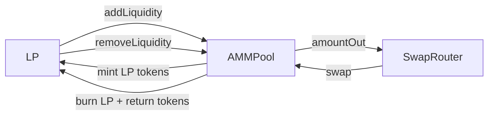

# AMMPool — Design Doc

## 1. Metadata
- **Status:** Draft
- **Owner:** 0x54190a788EEf66d9AbddcF7d135B09B4D2b72F3A
- **Target chains:** Arc Testnet, Base Sepolia, Arbitrum Sepolia, OP Sepolia, Polygon Amoy, Avalanche Fuji, Ethereum Sepolia
- **Language/Toolchain:** Solidity 0.8.28, Foundry
- **Reviews:** [ ] Design [ ] Security [ ] Ops

## 2. Action Items
_Empty at draft time._

## 3. Goals / Non-Goals
**Goals:**
- Constant-product AMM (x*y=k) for any two ERC-20 token pair
- LP tokens minted proportionally on `addLiquidity`, burned on `removeLiquidity`
- `swap` callable only by registered SwapRouter (access-controlled)
- Emit events for liquidity adds/removes and swaps

**Non-Goals:**
- No fee collection in pool (fee handled by SwapRouter)
- No flash loans in v1
- No price oracle (TWAP) in v1

## 4. Requirements
- `addLiquidity(uint256 amountA, uint256 amountB, address to)` — anyone
- `removeLiquidity(uint256 lpAmount, uint256 minA, uint256 minB, address to)` — LP holders
- `swap(address tokenIn, uint256 amountIn, uint256 minOut, address to)` — SwapRouter only
- Minimum liquidity lock (1000 wei) burned to zero on first add
- `k` invariant enforced after every swap

## 5. Actors
| Actor | Trust | Capabilities |
|---|---|---|
| LiquidityProvider | Untrusted | addLiquidity, removeLiquidity |
| SwapRouter | Semi-trusted (registered) | swap |
| Owner | Trusted | Register router, pause |

## 6. Language / Runtime
Solidity 0.8.28, Paris EVM, OZ 5.1.0 (ERC-20 for LP token, Ownable2Step, Pausable, ReentrancyGuard, SafeERC20). AMMPool IS an ERC-20 (LP token).

## 9. Architecture


**Invariant:** `reserveA * reserveB == k` (after swap, before fee adjustment by router).

## 10. Contract Design

**Storage:**
```solidity
address public tokenA;
address public tokenB;
uint112 public reserveA;
uint112 public reserveB;
address public router;        // only address that can call swap
uint256 public constant MINIMUM_LIQUIDITY = 1000;
// Inherits ERC-20 totalSupply for LP shares
```

**Functions:**
| Function | Caller | State | Events | Reverts |
|---|---|---|---|---|
| `addLiquidity(amtA,amtB,to)` | anyone | mint LP | `LiquidityAdded` | paused, zero amounts |
| `removeLiquidity(lp,minA,minB,to)` | LP holder | burn LP | `LiquidityRemoved` | paused, slippage |
| `swap(tokenIn,amtIn,minOut,to)` | router | update reserves | `Swapped` | paused, not router, k violated |
| `setRouter(address)` | owner | `router=addr` | `RouterSet` | zero addr |

## 11. Security
| Vulnerability | Applicable? | Mitigation |
|---|---|---|
| Reentrancy | Yes | `nonReentrant` |
| k-invariant violation | Yes | assert `newK >= oldK` after swap |
| Minimum liquidity | Yes | 1000 wei burned to 0x0 on first add |
| Integer overflow | No | Solidity 0.8.28; reserves cast to uint256 for math |
| Access control (swap) | Yes | `onlyRouter` modifier |

## 12. Deployment
Constructor: `address tokenA_, address tokenB_, address initialOwner`. Deploy pool per pair, then register in SwapRouter.

## 13. Testing
Unit: add/remove liquidity, swap math (x*y=k), k violation revert, slippage revert, access control.
