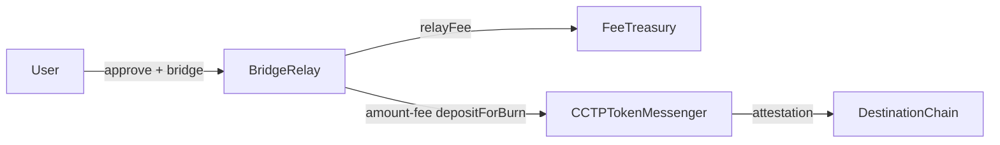

# BridgeRelay — Design Doc

## 1. Metadata
- **Status:** Draft
- **Owner:** 0x54190a788EEf66d9AbddcF7d135B09B4D2b72F3A
- **Target chains:** Arc Testnet, Base Sepolia, Arbitrum Sepolia, OP Sepolia, Polygon Amoy, Avalanche Fuji, Ethereum Sepolia
- **Language/Toolchain:** Solidity 0.8.28, Foundry
- **Reviews:** [ ] Design [ ] Security [ ] Ops

## 2. Action Items
_Empty at draft time._

## 3. Goals / Non-Goals
**Goals:**
- Thin relay wrapper around Circle's CCTP `TokenMessenger.depositForBurn`
- Caller specifies destination chain (Circle domain ID), recipient on destination, and amount
- Deduct a flat relay fee (in USDC) and forward it to FeeTreasury
- Emit a `BridgeInitiated` event with nonce for frontend tracking

**Non-Goals:**
- Does not perform attestation or minting (CCTP Message Transmitter handles that)
- Does not custody USDC beyond the single transaction
- Does not support non-USDC tokens in v1

## 4. Requirements
- `bridge(uint32 destinationDomain, bytes32 recipient, uint256 amount)` — anyone
- Net bridged amount = `amount - relayFee`
- `relayFee` is set by owner (in USDC raw units), bounded to ≤ 1% of amount
- CCTP `depositForBurn` called with `burnToken = USDC`, `mintRecipient = recipient`

## 5. Actors
| Actor | Trust | Capabilities |
|---|---|---|
| Caller | Untrusted | Initiate bridge |
| Owner | Trusted | Set relay fee, set treasury, pause |
| CCTP TokenMessenger | External protocol | Burn USDC on source chain |

## 6. Language / Runtime
Solidity 0.8.28, Paris EVM, OZ 5.1.0.

## 9. Architecture


**Flow of funds:**
| Step | Who | Invariant |
|---|---|---|
| Pull USDC | User → Relay | `amount pulled` |
| Fee to treasury | Relay → Treasury | `fee = relayFee (flat)` |
| Net to CCTP | Relay → CCTP burn | `netAmount = amount - fee; netAmount > 0` |

Resting-state: Relay holds no USDC between transactions.

## 10. Contract Design

**Storage:**
```solidity
address public usdc;
address public tokenMessenger;  // CCTP TokenMessenger address
address public feeTreasury;
uint256 public relayFee;         // flat fee in USDC base units (e.g. 100 = 0.0001 USDC at 6 dec)
```

**CCTP domain IDs (for reference):**
| Chain | Domain |
|---|---|
| Ethereum | 0 |
| Avalanche | 1 |
| OP | 2 |
| Arbitrum | 3 |
| Base | 6 |
| Polygon | 7 |
| Arc Testnet | 9 |

**Functions:**
| Function | Caller | State | Events | Reverts |
|---|---|---|---|---|
| `bridge(domain,recipient,amount)` | anyone | pulls USDC, calls CCTP | `BridgeInitiated(nonce)` | paused, amount≤fee, zero recipient |
| `setRelayFee(uint256)` | owner | `relayFee=fee` | `RelayFeeUpdated` | fee>amount cap |
| `setFeeTreasury(address)` | owner | update addr | `TreasuryUpdated` | zero addr |
| `setTokenMessenger(address)` | owner | update CCTP addr | `MessengerUpdated` | zero addr |

## 11. Security
| Vulnerability | Applicable? | Mitigation |
|---|---|---|
| Reentrancy | Yes | `nonReentrant` + CEI |
| Zero recipient | Yes | `recipient != bytes32(0)` |
| Fee drain | Yes | `relayFee < amount` enforced; bounded to 1% |
| CCTP address substitution | Yes | owner-settable but emits event; future: immutable |
| Unchecked ERC-20 return | Yes | SafeERC20 |

## 12. Deployment
Constructor: `address usdc_, address tokenMessenger_, address feeTreasury_, uint256 relayFee_, address initialOwner`. Set correct CCTP TokenMessenger per chain.

**CCTP TokenMessenger addresses (testnet):**
- ETH Sepolia: `0x9f3B8679c73C2Fef8b59B4f3444d4e156fb70AA5`
- Base Sepolia / Avax Fuji / ARB Sepolia / OP Sepolia / Polygon Amoy: see Circle docs
- Arc Testnet: see onchain-facts module

## 13. Testing
Unit: bridge happy path, fee deduction, zero recipient revert, amount≤fee revert, fee-too-high revert, access control.
