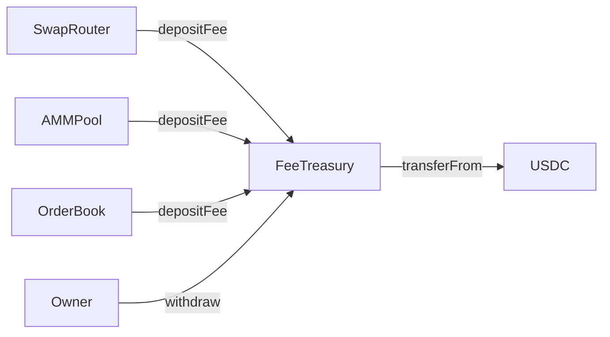

# FeeTreasury — Design Doc

## 1. Metadata
- **Status:** Draft
- **Owner:** 0x54190a788EEf66d9AbddcF7d135B09B4D2b72F3A
- **Target chains:** Arc Testnet, Base Sepolia, Arbitrum Sepolia, OP Sepolia, Polygon Amoy, Avalanche Fuji, Ethereum Sepolia
- **Language/Toolchain:** Solidity 0.8.28, Foundry
- **EVM version:** Paris
- **Reviews:** [ ] Design [ ] Security [ ] Ops

## 2. Action Items
_Empty at draft time._

## 3. Goals / Non-Goals
**Goals:**
- Collect protocol fees (USDC) from SwapRouter, AMMPool, and OrderBook contracts
- Allow owner to withdraw accumulated fees to any address
- Emit events for every deposit and withdrawal for off-chain accounting
- Support emergency pause to halt deposits

**Non-Goals:**
- Does not custody user funds beyond collected fees
- Does not perform swaps or trades
- Does not distribute fees automatically (pull pattern only)

## 4. Requirements
**Functional:**
- Any registered collector contract can call `depositFee(uint256 amount)` to push USDC in
- Owner can call `withdraw(address to, uint256 amount)` to pull USDC out
- Owner can register/deregister collector addresses
- Emergency pause halts all deposits

**Security:**
- Only registered collectors may deposit fees (whitelist)
- Only owner may withdraw, register/deregister collectors, pause/unpause
- Reentrancy protected on all external calls
- Two-step ownership transfer (Ownable2Step)

## 5. Terminology & Actors

| Actor | On/Off-chain | Trust | Capabilities |
|---|---|---|---|
| Owner | Off-chain EOA | Trusted | Withdraw, register collectors, pause/unpause, transfer ownership |
| Collector | On-chain contract | Semi-trusted (whitelisted) | Deposit fees only |
| Anyone | Off-chain | Untrusted | Read balances, read events |

## 6. Language / Runtime
- Solidity 0.8.28, built-in overflow checks
- Paris EVM (no Cancun opcodes)
- OpenZeppelin 5.1.0: Ownable2Step, Pausable, ReentrancyGuard, SafeERC20

## 7. Transaction & Execution Model
All state committed atomically. CEI ordering on all external calls. `nonReentrant` on `depositFee` and `withdraw`.

## 8. Chain Standards & Interfaces
ERC-20 (USDC) interactions via SafeERC20. No custom token standard.

## 9. Architecture Overview

**Flow of funds:**
| Step | Who moves what | Invariant |
|---|---|---|
| Collector calls depositFee | Collector → FeeTreasury (USDC) | `treasuryBalance += amount` |
| Owner calls withdraw | FeeTreasury → recipient (USDC) | `treasuryBalance -= amount; amount ≤ treasuryBalance` |

Resting-state invariant: `usdc.balanceOf(treasury) == totalDeposited - totalWithdrawn`.

## 10. Contract Design

**Roles:**
| Role | Holder | Permissions |
|---|---|---|
| owner | 0x54190a788EEf66d9AbddcF7d135B09B4D2b72F3A | withdraw, register, pause, ownership transfer |
| collector | Whitelisted contracts | depositFee only |

**Storage:**
```solidity
address public usdc;
mapping(address => bool) public isCollector;
uint256 public totalCollected;
uint256 public totalWithdrawn;
```

**Functions (writes):**
| Function | Caller | State | Events | Reverts |
|---|---|---|---|---|
| `registerCollector(address)` | owner | `isCollector[addr]=true` | `CollectorRegistered` | zero addr |
| `deregisterCollector(address)` | owner | `isCollector[addr]=false` | `CollectorDeregistered` | not registered |
| `depositFee(uint256)` | collector | `totalCollected+=amount` | `FeeDeposited` | paused, not collector, amount==0 |
| `withdraw(address,uint256)` | owner | `totalWithdrawn+=amount` | `FeeWithdrawn` | paused, zero addr, insufficient balance |
| `pause()/unpause()` | owner | pause state | `Paused/Unpaused` | — |

## 11. Security Considerations
| Vulnerability | Applicable? | Mitigation |
|---|---|---|
| Reentrancy | Yes | `nonReentrant` + CEI on depositFee/withdraw |
| Access control | Yes | Ownable2Step + collector whitelist |
| Integer overflow | No | Solidity 0.8.28 |
| Unchecked ERC-20 return | Yes | SafeERC20 |
| Centralization risk | Yes | Owner is single EOA; documented blast radius |

## 12. Deployment & Initialization
Constructor args: `address usdc_, address initialOwner`. No proxy — immutable.
Deploy on all 7 EVM testnets. Register SwapRouter, AMMPool, OrderBook as collectors post-deploy.

## 13. Upgradeability
Immutable. Migration = deploy new treasury, update collector references, drain old treasury.

## 14. Key Management
Owner = `0x54190a788EEf66d9AbddcF7d135B09B4D2b72F3A`. Two-step transfer via Ownable2Step.

## 15. Emergency Response
`pause()` halts deposits. Withdrawals remain available to owner even when paused (so funds are never locked).

## 16. Testing Strategy
- Unit: happy path deposit/withdraw, access control reverts, pause behavior, ownership transfer
- Fuzz: deposit amounts, withdrawal amounts vs balance
- Slither static analysis
