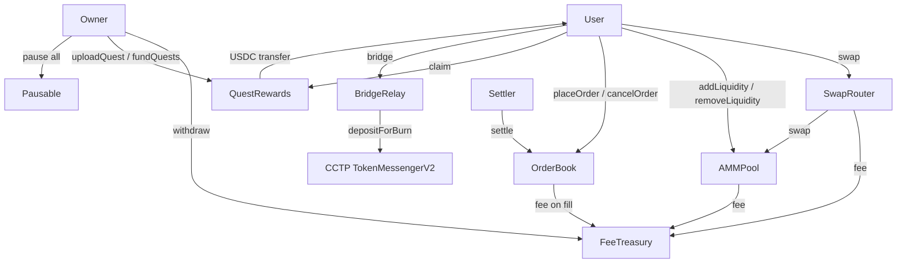

# NexusDEX Smart-Contract Suite — Design Document

**Status:** Draft  
**Authors:** Arc Studio  
**Target chains:** Arc Testnet · Base Sepolia · Arbitrum Sepolia · OP Sepolia · Polygon Amoy · Avalanche Fuji · Ethereum Sepolia  
**Language / Toolchain:** Solidity 0.8.24 · Foundry (forge 0.2.x) · OpenZeppelin Contracts 5.1.0  
**Milestone:** Testnet v1  
**Reviews:**  
- [ ] Design review  
- [ ] Security review  
- [ ] Ops review  

---

## Action Items (living)

_Empty at draft time — fill after each review round._

---

## 1. Goals / Non-Goals

### Goals
- Deploy a composable DeFi suite (swap, bridge relay, AMM pool, order book, quest rewards, fee treasury) on 7 EVM testnets from a single Solidity codebase.
- Charge a flat 5 bps (0.05%) fee on all swaps, trades, and pool actions, collected into a single `FeeTreasury` per chain.
- Allow an admin to pause all contracts in an emergency via OpenZeppelin `Pausable`.
- Run daily quests that reward users with USDC from the `QuestRewards` contract.
- Keep all contracts immutable (no proxy) for v1.

### Non-Goals
- Mainnet deployment (testnet only in this version).
- Upgradeable contracts / proxy patterns.
- Governance tokens or protocol-owned liquidity.
- Cross-chain order matching (orders are chain-local).
- Real oracle integration (prices are off-chain in v1; contracts validate slippage bounds only).

---

## 2. Requirements

### Functional
- `FeeTreasury`: accept fee deposits from sibling contracts; allow owner to withdraw accumulated fees; emit events on deposit and withdrawal.
- `SwapRouter`: accept `tokenIn`, `amountIn`, `tokenOut`, `minAmountOut`; deduct 5 bps fee; forward to AMM pool or external liquidity; emit `Swap` event.
- `AMMPool`: constant-product AMM (x·y=k) for a USDC/token pair; provide `addLiquidity`, `removeLiquidity`, `swap`; mint/burn LP tokens; collect fee into treasury.
- `BridgeRelay`: wrap Circle CCTP v2 `TokenMessengerV2.depositForBurn`; emit `BridgeInitiated` with CCTP nonce; allow emergency withdrawal by owner.
- `OrderBook`: on-chain limit/stop order placement and cancellation; off-chain matching with on-chain settlement; 5 bps fee on fill; emit `OrderPlaced`, `OrderFilled`, `OrderCancelled`.
- `QuestRewards`: owner uploads quests (id, description, reward amount, deadline, cap); users claim once per quest; USDC transferred on claim; emit `QuestCreated`, `QuestClaimed`.

### Security
- No path lets a non-owner withdraw treasury funds.
- No path lets a user claim a quest reward more than once.
- No path lets a swap or trade settle below the user-specified `minAmountOut` / `minFillPrice`.
- All USDC transfers use `SafeERC20`.
- All external calls follow Checks-Effects-Interactions.
- Reentrancy guard on every function that moves funds.
- Emergency pause halts all state-mutating user functions across all contracts.

---

## 3. Terminology & Actors

| Term | Definition |
|------|-----------|
| USDC | Circle's on-chain stablecoin; the quote token and fee token for all contracts |
| LP token | ERC-20 minted by `AMMPool` to represent a liquidity share |
| Quest | An admin-defined task with a fixed USDC reward claimable once per address |
| Fee | 5 bps of the trade/swap notional, sent to `FeeTreasury` |
| CCTP | Circle Cross-Chain Transfer Protocol v2 |

| Actor | On/off-chain | Trust | Capabilities |
|-------|-------------|-------|-------------|
| `owner` | Off-chain EOA / multisig | Trusted | Pause/unpause, withdraw fees, upload quests, update fee rate (bounded), set treasury address |
| `settler` | Off-chain keeper | Semi-trusted | Call `OrderBook.settle()` with matched orders; cannot steal funds (settlement is validated on-chain) |
| `user` | Off-chain EOA | Untrusted | Swap, add/remove liquidity, place/cancel orders, claim quests |
| `CCTP TokenMessenger` | On-chain Circle contract | Trusted | Receives USDC burn call from `BridgeRelay`; emits attestation |

---

## 4. Language / Runtime

- **Solidity 0.8.24** — checked arithmetic by default, custom errors for gas efficiency.
- **EVM target: paris** (foundry.toml) — no Cancun opcodes; compatible with all 7 target testnets.
- **OpenZeppelin 5.1.0** — `Ownable2Step`, `Pausable`, `ReentrancyGuard`, `SafeERC20`, `ERC20`.
- **Foundry** — `forge build`, `forge test`, `forge script`.

---

## 5. Transaction & Execution Model

All contracts are atomic: a revert undoes all state changes in the call. CEI (Checks-Effects-Interactions) is applied at every function that moves tokens:

1. **Check** — validate inputs, access, state.  
2. **Effect** — update all internal state (balances, mappings, counters).  
3. **Interact** — external token transfers last.  

`ReentrancyGuard.nonReentrant` guards every function that calls `safeTransfer*`.

---

## 6. Architecture Overview



**Flow of funds:**

| Step | Who moves what | Invariant |
|------|---------------|-----------|
| Swap: user sends tokenIn | User → SwapRouter | `amountIn` received ≥ declared |
| Swap: fee deducted | SwapRouter → FeeTreasury | fee = `amountIn × feeBps / 10_000` |
| Swap: tokenOut sent | AMMPool → User | `amountOut ≥ minAmountOut` |
| AddLiquidity | User → AMMPool | LP minted proportional to reserves |
| RemoveLiquidity | AMMPool → User | reserves decrease by pro-rata share |
| OrderFill: fee | SwapRouter/OrderBook → FeeTreasury | fee on notional |
| Bridge | User → BridgeRelay → CCTP burn | no USDC held by relay post-call |
| Quest claim | QuestRewards → User | one claim per address per quest; balance decremented |
| Fee withdrawal | FeeTreasury → Owner | only `owner`; emits event |

**Resting-state invariant:** `BridgeRelay` holds no USDC after a successful bridge call. `SwapRouter` holds no tokens at rest (all routed or returned). `FeeTreasury` accumulates fees until owner withdraws.

---

## 7. Contract Design

### 7.1 FeeTreasury

**Storage:**
```
address public owner              // Ownable2Step
address public usdc               // immutable USDC address
uint256 public totalCollected     // running total
```

**Write functions:**

| Function | Caller | State | Events | Reverts |
|----------|--------|-------|--------|---------|
| `depositFee(uint256)` | sibling contracts (no access control — anyone may deposit) | increments `totalCollected` | `FeeDeposited(amount)` | transfer fails |
| `withdraw(address to, uint256 amount)` | `owner` | decrements balance | `FeeWithdrawn(to, amount)` | not owner; amount > balance |
| `setUsdcAddress(address)` | `owner` | updates `usdc` | `UsdcAddressUpdated` | not owner; zero address |

---

### 7.2 SwapRouter

**Storage:**
```
address public usdc
address public treasury
uint16  public feeBps             // 5 initially; owner can update ≤ 100 bps
mapping(address => bool) public poolRegistry
```

**Write functions:**

| Function | Caller | State | Events | Reverts |
|----------|--------|-------|--------|---------|
| `swap(address tokenIn, uint256 amountIn, address tokenOut, uint256 minAmountOut, address pool)` | anyone, not paused | pulls tokenIn, sends fee, calls pool | `Swap(user, tokenIn, tokenOut, amountIn, amountOut, fee)` | paused; pool not registered; amountOut < min |
| `registerPool(address pool)` | `owner` | adds to registry | `PoolRegistered(pool)` | not owner |
| `setFeeBps(uint16)` | `owner` | updates `feeBps` | `FeeBpsUpdated(bps)` | not owner; bps > 100 |

---

### 7.3 AMMPool

Constant-product AMM: `reserve0 × reserve1 = k` where token0 = USDC, token1 = paired token.

**Storage:**
```
address public token0   // USDC
address public token1   // e.g. WETH
uint112 private reserve0
uint112 private reserve1
uint256 public totalSupply  // LP tokens (ERC20)
address public treasury
uint16  public feeBps
```

**Write functions:**

| Function | Caller | State | Events | Reverts |
|----------|--------|-------|--------|---------|
| `addLiquidity(uint256 amount0, uint256 amount1, uint256 minLP)` | anyone, not paused | updates reserves, mints LP | `LiquidityAdded` | slippage; paused |
| `removeLiquidity(uint256 lpAmount, uint256 min0, uint256 min1)` | LP holder, not paused | burns LP, updates reserves | `LiquidityRemoved` | insufficient LP; slippage |
| `swap(address tokenIn, uint256 amountIn, uint256 minAmountOut, address to)` | SwapRouter or user | updates reserves, sends fee | `Swap` | paused; minAmountOut; bad token |

---

### 7.4 BridgeRelay

Thin wrapper around CCTP v2 `TokenMessengerV2.depositForBurn`. Holds no funds at rest.

**Storage:**
```
address public usdc
address public tokenMessenger    // CCTP TokenMessengerV2 (immutable per chain)
address public treasury
uint16  public feeBps
```

**Write functions:**

| Function | Caller | State | Events | Reverts |
|----------|--------|-------|--------|---------|
| `bridge(uint256 amount, uint32 destinationDomain, bytes32 mintRecipient)` | anyone, not paused | pulls USDC, deducts fee, calls `depositForBurn` | `BridgeInitiated(user, amount, destinationDomain, nonce)` | paused; zero amount; zero recipient |
| `emergencyWithdraw(address token, uint256 amount)` | `owner` | transfers token to owner | `EmergencyWithdraw` | not owner |

---

### 7.5 OrderBook

On-chain order placement + cancellation. Settlement is done by a trusted off-chain `settler` calling `settle()` with matched order pairs. On-chain validation ensures no under-filled trades.

**Storage:**
```
struct Order {
  address maker;
  address tokenSell;
  address tokenBuy;
  uint256 amountSell;
  uint256 minAmountBuy;  // slippage bound
  uint64  expiry;
  bool    filled;
  bool    cancelled;
}
mapping(bytes32 => Order) public orders
address public settler
address public treasury
uint16  public feeBps
```

**Write functions:**

| Function | Caller | State | Events | Reverts |
|----------|--------|-------|--------|---------|
| `placeOrder(Order)` | anyone, not paused | stores order, pulls tokenSell | `OrderPlaced(id, maker, ...)` | paused; zero amounts; expired |
| `cancelOrder(bytes32 id)` | order maker | marks cancelled, returns tokenSell | `OrderCancelled(id)` | not maker; already filled |
| `settle(bytes32 idA, bytes32 idB, uint256 fillAmountA)` | `settler`, not paused | fills both orders, sends tokens, deducts fee | `OrderFilled(id, ...)` × 2 | paused; not settler; expired; below minAmountBuy |

---

### 7.6 QuestRewards

Admin uploads quests with a fixed USDC reward. Users claim once. Contract must be pre-funded with USDC by owner.

**Storage:**
```
struct Quest {
  string  description;
  uint256 rewardAmount;
  uint64  deadline;
  uint32  maxClaims;
  uint32  claimCount;
  bool    active;
}
mapping(uint256 => Quest) public quests
mapping(uint256 => mapping(address => bool)) public claimed
uint256 public nextQuestId
address public usdc
```

**Write functions:**

| Function | Caller | State | Events | Reverts |
|----------|--------|-------|--------|---------|
| `createQuest(string, uint256, uint64, uint32)` | `owner` | adds quest | `QuestCreated(id, reward, deadline)` | not owner; zero reward; deadline in past |
| `activateQuest(uint256)` / `deactivateQuest(uint256)` | `owner` | flips `active` | `QuestActivated` / `QuestDeactivated` | not owner |
| `claim(uint256 questId)` | anyone, not paused | marks claimed, transfers USDC | `QuestClaimed(questId, user, amount)` | already claimed; not active; expired; cap hit; paused |
| `fundQuests(uint256 amount)` | `owner` | pulls USDC into contract | `QuestsFunded(amount)` | not owner |
| `withdrawUnclaimed(uint256 amount)` | `owner` | transfers USDC to owner | `UnclaimedWithdrawn` | not owner |

---

## 8. Security Considerations

| Vulnerability | Applicable? | Mitigation |
|---|---|---|
| Reentrancy | Yes | CEI + `nonReentrant` on all fund-moving functions |
| Access control | Yes | `Ownable2Step`; `settler` role on `OrderBook`; no anonymous privilege |
| Integer overflow | Solidity ≥0.8 checked | `unchecked` used only in LP mint math with explicit bounds |
| Unchecked external call | Yes | `SafeERC20` for all USDC transfers; return values checked |
| Fee-on-transfer tokens | USDC only — known fixed decimals | balance-delta pattern in `AMMPool.addLiquidity` |
| Front-running / MEV | Yes on AMM | `minAmountOut` slippage bound enforced on-chain |
| Signature replay | N/A in v1 | No off-chain signatures in v1 |
| Flash-loan / price manipulation | Low (no oracle) | AMM uses on-chain reserves only; slippage bounds protect users |
| DoS | Yes | pull-over-push; no unbounded loops |
| Timestamp dependence | Order expiry, quest deadline | 2-minute tolerance acceptable for these use cases |
| Approval persistence | Yes | `approve(0)` before `approve(amount)` in router |
| Centralization risk | Yes | Single owner; documented; multisig recommended for prod |
| CCTP relay trust | Yes | `BridgeRelay` calls official CCTP contract only; address immutable |

---

## 9. Trust Model & Threat Analysis

| Actor | Worst-case if compromised | Mitigation | Detection |
|-------|--------------------------|-----------|-----------|
| `owner` key | Drain treasury, disable quests, pause all contracts | Use multisig in prod; timelocks recommended for mainnet | Monitor `FeeWithdrawn`, `Paused` events |
| `settler` key | Forge order matches (bounded by on-chain slippage check) | `settler` cannot exceed `minAmountBuy` invariant; worst case: order expired/unfilled | Monitor `OrderFilled` events for anomalies |
| CCTP `TokenMessengerV2` | Brick bridge if Circle pauses CCTP | `emergencyWithdraw` on relay | CCTP status page |

---

## 10. Emergency Response

- **Pause:** owner calls `pause()` on any contract — halts all user-facing state mutations.
- **Unpause:** owner calls `unpause()`.
- **Stuck tokens:** `FeeTreasury.withdraw` and `BridgeRelay.emergencyWithdraw` cover stuck USDC.
- **Incident playbook:** (1) pause affected contract, (2) investigate on-chain events, (3) deploy fix + redeploy (immutable — new address), (4) communicate to users.

---

## 11. Deployment & Initialization

- Constructor args set `usdc`, `treasury`, `feeBps`, `initialOwner` at deploy time — no `initialize()`.
- `_disableInitializers()` not needed (no proxy).
- Deploy order: `FeeTreasury` → `AMMPool` → `SwapRouter` (register pool) → `OrderBook` → `BridgeRelay` → `QuestRewards`.
- Owner address: `0x5B12Ce46C7194aD57d143bC22847224047b1Ef42` (Circle deployer — **replace with your own wallet before mainnet**).
- USDC addresses per chain sourced from Circle's official registry (hardcoded per chain in constructor call).

---

## 12. Upgradeability

Immutable in v1. Migration path: deploy new suite, emit `ContractMigrated` event, update frontend config to new addresses. No storage migration needed.

---

## 13. Testing Strategy

- **Unit tests (Foundry):** happy path + revert paths + fuzz key arithmetic for every write function.
- **Invariant tests:** AMMPool `k` never decreases; QuestRewards claimed count never exceeds `maxClaims`.
- **Static analysis:** Slither on all contracts.
- **Integration tests:** post-deploy on Arc Testnet via Circle developer-controlled wallets.
- Run: `forge test -vvv` / `forge test --gas-report`.

---

## 14. Third-Party Libraries

| Library | Version | Dependency? | Why | Audited? |
|---------|---------|-------------|-----|---------|
| OpenZeppelin Contracts | 5.1.0 | Yes (pinned) | `Ownable2Step`, `Pausable`, `ReentrancyGuard`, `SafeERC20`, `ERC20` | Yes |

---

## 15. Solana Design Spec (non-EVM, spec only)

See section below — source code is NOT produced for Solana. A Rust/Anchor developer should implement from this spec.

### Solana Program Architecture

**Programs:**
- `nexus_fee_treasury` — PDA-owned USDC ATA collects fees; owner keypair can withdraw.
- `nexus_swap_router` — CPIs into AMM pool; deducts 5 bps to treasury.
- `nexus_amm_pool` — constant-product AMM; mint/burn LP SPL tokens.
- `nexus_bridge_relay` — CPI into Circle's CCTP Solana program (`TokenMessengerMinter`).
- `nexus_order_book` — PDA per order; settler resolves matched pairs.
- `nexus_quest_rewards` — PDA per quest; `claimed` bitmap per quest PDA.

**Accounts (common pattern):**
- `Config` PDA (seeds: `[b"config"]`) — owner pubkey, fee bps, treasury ATA.
- Per-pool `PoolState` PDA (seeds: `[b"pool", token_mint]`) — reserves, LP mint.
- Per-order `OrderState` PDA (seeds: `[b"order", maker, nonce]`) — order data, escrow ATA.
- Per-quest `QuestState` PDA (seeds: `[b"quest", quest_id]`) — reward, deadline, cap.
- `ClaimedBitmap` PDA (seeds: `[b"claimed", quest_id, user]`) — one bool per (quest, user).

**Instructions mirror EVM functions above.** All USDC transfers use SPL Token `transfer_checked`. No upgradeable program in v1 — deploy new program ID on breaking change.
