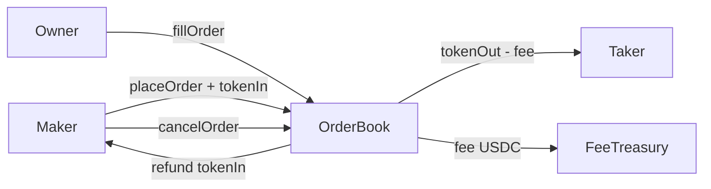

# OrderBook — Design Doc

## 1. Metadata
- **Status:** Draft
- **Owner:** 0x54190a788EEf66d9AbddcF7d135B09B4D2b72F3A
- **Fee rate:** 5 bps (0.05%) on filled amount
- **Target chains:** Arc Testnet, Base Sepolia, Arbitrum Sepolia, OP Sepolia, Polygon Amoy, Avalanche Fuji, Ethereum Sepolia
- **Language/Toolchain:** Solidity 0.8.28, Foundry
- **Reviews:** [ ] Design [ ] Security [ ] Ops

## 2. Action Items
_Empty at draft time._

## 3. Goals / Non-Goals
**Goals:**
- On-chain limit order placement and cancellation
- Owner-operated matching: owner calls `fillOrder(orderId, matchedAmount)` to execute a match
- Filled portion fee deducted and sent to FeeTreasury
- Fully filled or cancelled orders refund/release tokens to maker/taker

**Non-Goals:**
- No fully decentralized matching engine in v1 (owner-operated for gas efficiency)
- No stop-limit orders in v1
- No partial fill from multiple makers in one tx in v1

## 4. Requirements
- `placeOrder(address tokenIn, address tokenOut, uint256 amountIn, uint256 minAmountOut, uint64 expiresAt)` — anyone
- `cancelOrder(uint256 orderId)` — order maker only
- `fillOrder(uint256 orderId, uint256 fillAmountIn, address taker)` — owner only
- Fee deducted from fillAmountIn before transferring to taker's tokenOut

## 5. Actors
| Actor | Trust | Capabilities |
|---|---|---|
| Maker | Untrusted | Place, cancel own orders |
| Owner/Matcher | Trusted | Fill orders, pause |
| Taker | EOA (named by owner) | Receives filled tokens |

## 6. Language / Runtime
Solidity 0.8.28, Paris EVM, OZ 5.1.0.

## 9. Architecture


**Flow of funds:**
| Step | Who | Invariant |
|---|---|---|
| Place | Maker → contract (tokenIn) | `orders[id].amountIn locked` |
| Fill | Contract → Taker (tokenOut-fee); Contract → Treasury (fee) | `filledAmount += fill; fee = fill*bps/10000` |
| Cancel | Contract → Maker (remaining tokenIn) | `orders[id].cancelled=true` |

## 10. Contract Design

**Storage:**
```solidity
struct Order {
    address maker;
    address tokenIn;
    address tokenOut;
    uint256 amountIn;
    uint256 filledAmountIn;
    uint256 minAmountOut;
    uint64  expiresAt;
    bool    cancelled;
}
mapping(uint256 => Order) public orders;
uint256 public orderCount;
uint16  public feeBps;
address public feeTreasury;
```

**Functions:**
| Function | Caller | State | Events | Reverts |
|---|---|---|---|---|
| `placeOrder(...)` | anyone | store order, pull tokenIn | `OrderPlaced` | paused, zero amount, expiry past |
| `cancelOrder(id)` | maker | mark cancelled, refund | `OrderCancelled` | not maker, already filled/cancelled |
| `fillOrder(id,fill,taker)` | owner | update filled, transfer | `OrderFilled` | paused, expired, over-fill, zero taker |

## 11. Security
| Vulnerability | Applicable? | Mitigation |
|---|---|---|
| Reentrancy | Yes | `nonReentrant` + CEI |
| Maker double-cancel | Yes | `cancelled` flag |
| Over-fill | Yes | `fillAmountIn + fill <= amountIn` check |
| Centralization (matcher) | Yes | Owner-operated; blast radius documented |
| Deadline | Yes | `block.timestamp <= expiresAt` |
| Fee-on-transfer tokens | Possible | Balance-delta on tokenIn pull |

## 12. Deployment
Constructor: `address feeTreasury_, uint16 feeBps_, address initialOwner`.

## 13. Testing
Unit: place/cancel/fill happy path, over-fill revert, cancel-then-fill revert, expiry revert, fee math, fuzz fill amounts.
