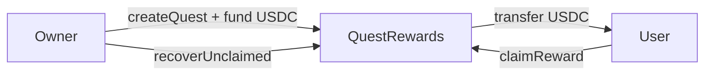

# QuestRewards — Design Doc

## 1. Metadata
- **Status:** Draft
- **Owner:** 0x54190a788EEf66d9AbddcF7d135B09B4D2b72F3A
- **Target chains:** Arc Testnet, Base Sepolia, Arbitrum Sepolia, OP Sepolia, Polygon Amoy, Avalanche Fuji, Ethereum Sepolia
- **Language/Toolchain:** Solidity 0.8.28, Foundry
- **Reviews:** [ ] Design [ ] Security [ ] Ops

## 2. Action Items
_Empty at draft time._

## 3. Goals / Non-Goals
**Goals:**
- Owner creates daily quests with USDC reward pool, max participants, and expiry timestamp
- Users claim quest rewards once per quest (one claim per address per quest)
- Reward is `pool / maxParticipants` distributed on a first-come-first-served basis
- Owner can top up the USDC pool and deactivate quests
- Emergency pause halts all claims

**Non-Goals:**
- Does not verify off-chain quest completion (trust model: owner vouches via signature or allowlist)
- Does not handle quest discovery — that is the frontend's job
- Does not mint tokens — rewards are USDC only

## 4. Requirements
**Functional:**
- `createQuest(string title, uint256 rewardPool, uint32 maxParticipants, uint64 expiresAt)` — owner only
- `claimReward(uint256 questId)` — any address, once per quest
- `deactivateQuest(uint256 questId)` — owner only
- `recoverUnclaimed(uint256 questId, address to)` — owner, after expiry
- Owner must pre-fund contract with USDC before creating quests

**Security:**
- One claim per (address, questId) — stored in mapping
- Claim only valid: quest active, not expired, participants < max, caller not already claimed
- Reentrancy guard on `claimReward`
- Two-step ownership

## 5. Terminology & Actors
| Actor | Trust | Capabilities |
|---|---|---|
| Owner | Trusted | Create/deactivate quests, recover unclaimed, pause |
| Participant | Untrusted | Claim reward once per quest |

## 6. Language / Runtime
Solidity 0.8.28, Paris EVM, OZ 5.1.0 (Ownable2Step, Pausable, ReentrancyGuard, SafeERC20).

## 7. Transaction & Execution Model
Atomic. CEI on `claimReward`: check eligibility → update state → transfer USDC.

## 8. Chain Standards
ERC-20 (USDC) via SafeERC20.

## 9. Architecture


**Flow of funds:**
| Step | Who | Invariant |
|---|---|---|
| Owner funds | Owner → contract (USDC) | `contractBalance += amount` |
| User claims | Contract → user (USDC reward) | `claimed[user][quest]=true; participants++` |
| Owner recovers | Contract → owner (USDC remainder) | After expiry only |

Resting-state: `usdc.balanceOf(contract) == sum(activePools) + unclaimed`.

## 10. Contract Design

**Storage:**
```solidity
struct Quest {
    string title;
    uint256 rewardPool;      // total USDC allocated
    uint256 rewardPerUser;   // rewardPool / maxParticipants
    uint32  maxParticipants;
    uint32  claimedCount;
    uint64  expiresAt;
    bool    active;
}
mapping(uint256 => Quest) public quests;
mapping(uint256 => mapping(address => bool)) public hasClaimed;
uint256 public questCount;
address public usdc;
```

**Functions (writes):**
| Function | Caller | State | Events | Reverts |
|---|---|---|---|---|
| `createQuest(...)` | owner | new Quest entry | `QuestCreated` | paused, zero pool, zero max, expiry in past |
| `claimReward(questId)` | any | `hasClaimed[id][msg.sender]=true; claimedCount++` | `RewardClaimed` | paused, not active, expired, already claimed, max reached |
| `deactivateQuest(questId)` | owner | `active=false` | `QuestDeactivated` | not active |
| `recoverUnclaimed(questId, to)` | owner | transfers remainder | `UnclaimedRecovered` | not expired |
| `fundContract(uint256 amount)` | anyone | USDC transfer in | `Funded` | — |

## 11. Security Considerations
| Vulnerability | Applicable? | Mitigation |
|---|---|---|
| Reentrancy | Yes | `nonReentrant` + CEI |
| Double-claim | Yes | `hasClaimed[id][addr]` mapping |
| Integer overflow | No | Solidity 0.8.28 |
| Unchecked ERC-20 | Yes | SafeERC20 |
| Fund drain by owner | Yes | Owner blast radius documented; future: timelock |
| Timestamp manipulation | Low | Expiry uses `block.timestamp`; tolerance ±15s acceptable |

## 12. Deployment & Initialization
Constructor: `address usdc_, address initialOwner`. Fund with USDC before creating quests.

## 13. Upgradeability
Immutable. New version = new deployment, owner migrates funds.

## 14. Testing Strategy
Unit: create/claim/deactivate/recover, double-claim revert, expiry checks, access control, fuzz reward amounts.
