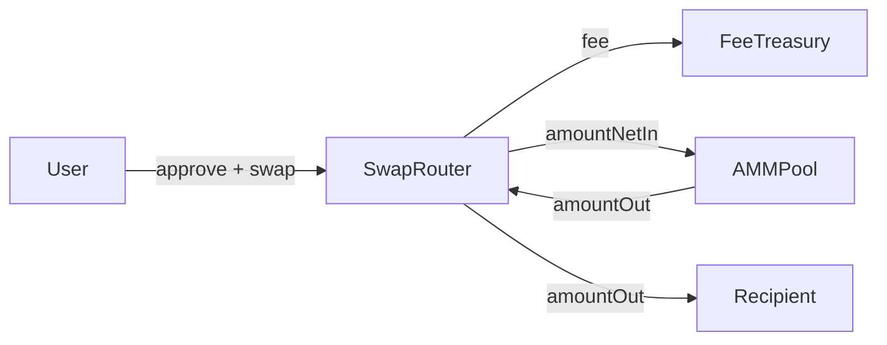

# SwapRouter — Design Doc

## 1. Metadata
- **Status:** Draft
- **Owner:** 0x54190a788EEf66d9AbddcF7d135B09B4D2b72F3A
- **Fee rate:** 5 bps (0.05%)
- **Target chains:** Arc Testnet, Base Sepolia, Arbitrum Sepolia, OP Sepolia, Polygon Amoy, Avalanche Fuji, Ethereum Sepolia
- **Language/Toolchain:** Solidity 0.8.28, Foundry
- **Reviews:** [ ] Design [ ] Security [ ] Ops

## 2. Action Items
_Empty at draft time._

## 3. Goals / Non-Goals
**Goals:**
- Accept exact-input swaps between two ERC-20 tokens via a registered AMMPool
- Deduct a 5 bps fee from amountIn and forward it to FeeTreasury
- Enforce a minimum amountOut (slippage guard) provided by the caller
- Owner can register/deregister pools and set fee rate (bounded 0–100 bps)
- Emergency pause halts all swaps

**Non-Goals:**
- Does not hold liquidity (delegates to AMMPool)
- Does not support multi-hop routing in v1
- Does not support native gas token swaps directly

## 4. Requirements
**Functional:**
- `swap(address tokenIn, address tokenOut, uint256 amountIn, uint256 minAmountOut, address recipient)` callable by anyone
- Router forwards `amountIn - fee` to pool, fee to FeeTreasury
- Pool returns `amountOut ≥ minAmountOut` or reverts

**Security:**
- Reentrancy guard on `swap`
- `minAmountOut > 0` enforced
- Deadline parameter enforced (caller specifies `uint256 deadline`)
- Fee cannot exceed 100 bps (owner-settable cap)
- CEI ordering

## 5. Actors
| Actor | Trust | Capabilities |
|---|---|---|
| Owner | Trusted | Register pools, set fee rate, pause |
| Swapper | Untrusted | Call swap |
| AMMPool | Semi-trusted (registered) | Execute swap logic |
| FeeTreasury | Semi-trusted (registered) | Receive fees |

## 6. Language / Runtime
Solidity 0.8.28, Paris EVM, OZ 5.1.0.

## 7. Transaction & Execution Model
Atomic. CEI on swap: validate inputs → pull amountIn from caller → send fee to treasury → send amountNetIn to pool → validate amountOut ≥ minAmountOut → transfer to recipient.

## 8. Architecture


**Flow of funds:**
| Step | Who | Invariant |
|---|---|---|
| Pull tokenIn | User → Router | `routerBal[tokenIn] += amountIn` |
| Fee to treasury | Router → Treasury | `fee = amountIn * feeBps / 10000` |
| Net to pool | Router → Pool | `netIn = amountIn - fee` |
| Out to recipient | Pool → Router → Recipient | `amountOut ≥ minAmountOut` |

Resting-state: Router holds no tokens between transactions.

## 10. Contract Design

**Storage:**
```solidity
uint16 public feeBps;          // 5 default
address public feeTreasury;
mapping(bytes32 => address) public pools; // keccak256(tokenA,tokenB) => pool
```

**Key functions:**
| Function | Caller | Events | Reverts |
|---|---|---|---|
| `swap(tokenIn,tokenOut,amountIn,minAmountOut,recipient,deadline)` | any | `Swapped` | paused, expired, no pool, amountOut<min |
| `registerPool(tokenA,tokenB,pool)` | owner | `PoolRegistered` | zero addr |
| `setFeeBps(uint16)` | owner | `FeeBpsUpdated` | >100 |
| `setFeeTreasury(address)` | owner | `TreasuryUpdated` | zero addr |

## 11. Security Considerations
| Vulnerability | Applicable? | Mitigation |
|---|---|---|
| Reentrancy | Yes | `nonReentrant` + CEI |
| Front-running | Yes | `minAmountOut` slippage + `deadline` |
| Fee-on-transfer tokens | Possible | balance-delta check on tokenIn receipt |
| Oracle manipulation | N/A | No oracle used |
| Access control | Yes | Ownable2Step |

## 12. Deployment
Constructor: `address usdc_, address feeTreasury_, uint16 feeBps_, address initialOwner`. Deploy then register pools.

## 13. Testing Strategy
Unit: swap happy path, slippage revert, deadline revert, fee calculation, access control, fuzz amountIn/minAmountOut.
